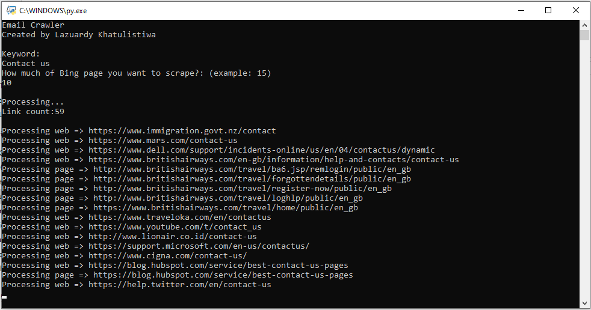

# email-crawler
Crawling emails from Bing search engine
<br><br>


## Prerequisites
- Python 3
- Python library: fake_useragent & requests

## How to use
- Install python 3
- Install fake_useragent & requests library, use pip:<br>```pip install fake_useragent```<br> ```pip install requests```
- Run email-crawler.py
- Emails are stored in results.txt
